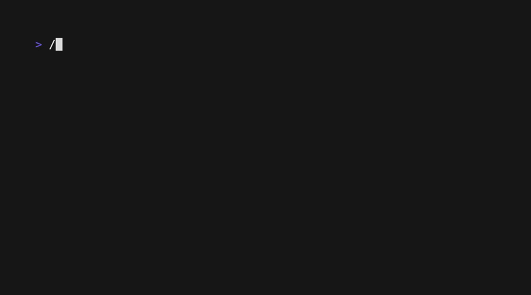

# qr-multi-imgs

**Scan a folder → decode QR → organize, export, recreate — from a clean TUI.**



[](https://go.dev)
[](LICENSE)
[](https://goreportcard.com/report/github.com/thousandflowers/qr-multi-imgs)
[](https://github.com/thousandflowers/qr-multi-imgs/actions/workflows/ci.yml)
[](https://codecov.io/gh/thousandflowers/qr-multi-imgs)


```bash
# One command — go, or curl, or brew:
go install github.com/thousandflowers/qr-multi-imgs@latest
qr-multi-imgs ./folder-of-qr-images
```

---

## Why

My father needed to catalog hundreds of photos of orders — each one a QR code on a receipt. No CLI could take a whole folder, keep the results, and then do something with them.

qr-multi-imgs is that missing step: point it at a folder, and the decoded codes come out the other side as files you can act on — sorted, exported, or regenerated.

### Input — 5 ways

CLI argument · **drag & drop a folder onto the terminal** · type a path · paste (`Cmd+V`) · clipboard (`Ctrl+D`)

---

## Comparison

Plenty of CLI QR scanners exist. None ship a TUI built for batch work.

| | qr-multi-imgs | [qr-scanner-cli](https://github.com/victorperin/qr-scanner-cli) | [qrtool](https://github.com/sorairolake/qrtool) |
| --- | --- | --- | --- |
| Interactive TUI | ✅ | ❌ | ❌ |
| Organize files (with/without QR) | ✅ | ❌ | ❌ |
| Delete images without QR | ✅ | ❌ | ❌ |
| Recreate QR (PNG/JPG/SVG) | ✅ | ❌ | bitmap only |
| Export (JSON/CSV/TXT) | ✅ | ❌ | ✅ |
| Drag & drop + clipboard | ✅ | ❌ | ❌ |
| Photographed QRs (Apple Vision, macOS) | ✅ | ❌ | ❌ |
| Nothing to install (no runtime deps) | ✅ | ❌ (Node) | ✅ |

---

## Benchmark

Dataset: [lovasoa/qrcode-dataset](https://github.com/lovasoa/qrcode-dataset) — **3332 damaged & distorted QR images** built to stress-test scanners. Each sample ships three files: the distorted `NNN.png`, the decoded `NNN.txt`, and `NNN.npy` — the generator's **source bit-matrix**.

| | image pixels only | with the companion `.npy` |
|---|---|---|
| **Detection** | ~57% | **3332/3332 (100%)** |
| **Time** | ~7m30s (v1.0, serial) | **~7s** |
| **Throughput** | ~7 img/s | **~475 img/s** |

**Read that 100% honestly.** It is not image decoding. It is decoding the answer
key this dataset happens to ship beside every image: when a `.npy` sits next to
the file, qr-multi-imgs decodes that bit-matrix first, in pure Go. That is
exactly what you want on this dataset and it never happens on your own photos.

**On pixels alone the same dataset scores ~57%**, and that number splits hard:

| subset | what it holds | image-only |
|---|---|---|
| `with_qr` | clean, stylized codes | ~100% |
| `without_qr` | colored, dense, low-contrast adversarial codes | ~25.7% |

The ~70% of `without_qr` left unread is not low-hanging fruit. The classical
ceiling, measured across the union of every colour channel, binarizer and scale
we could throw at it, is ~28% with gozxing and ~30.3% with `zbarimg`. Passing it
needs an ML detector (WeChat/CNN), which means an OpenCV C dependency — the
thing this tool exists to avoid.

**Why the dense codes fail — measured, not assumed.** Not because the modules
are sub-pixel: a clean 153x153-module QR rendered at 256 px (1.67 px per module,
well under two) decodes fine straight from the pixels. What destroys it is the
dataset's *distortion*; density only decides how little of it is enough. Under a
box blur, 61 modules survives radius 2 and fails at 3, 97 and 125 fail at 2, and
153 fails already at 1. In every one of those failures the `.npy` still decodes.

**Since v1.5.0 a scan is slower on purpose.** Earlier versions stopped at the
first code in an image; v1.5.0 returns every code in it. On 40 real photos that
moved 3.9s to 18.4s. The unbounded strategy union would have cost 122.6s — the
finder-pattern pre-pass is what keeps it at 18.

```bash
# Reproduce — the dataset is generated, not stored in the repo:
git clone https://github.com/lovasoa/qrcode-dataset
cd qrcode-dataset && pipenv install && pipenv run python generate_dataset.py
qr-multi-imgs ./dataset
```

Layout decides which number you measure: keep `png`, `npy` and `txt` co-located
and the companion path resolves (100%); separate the images into subfolders and
it does not, which measures the image-only path instead.

Measured on an Apple M2 Pro (10 cores, 16 GB).

---

## TUI actions

| Key | Action |
| --- | --- |
| `l` | List results |
| `e` | Export (JSON/CSV/TXT) |
| `d` | Delete images without a QR code |
| `o` | Organize into `with_qr/` and `without_qr/` |
| `r` | Recreate QR codes from decoded content (choose PNG/JPG/SVG) |
| `q` / `^C` | Quit |

---

## Web UI

Same actions as the TUI, in a browser, driven by the copy of the program running
on your own machine:

```bash
qr-multi-imgs --serve
```

It prints two links. Both open the **same page** — the binary embeds the very
file GitHub Pages serves, so there is no second copy drifting out of step:

| | | needs |
|---|---|---|
| **Local UI** | `http://127.0.0.1:8787/#t=...` | nothing; works in every browser |
| **Hosted UI** | `thousandflowers.github.io/qr-multi-imgs/#t=...&api=...` | one permission, see below |

**Nothing is uploaded, and that is enforced rather than promised.** Your images
are read by the local process and never leave the machine. The page carries a
`Content-Security-Policy` whose `connect-src` allows only its own origin and the
loopback, so it *cannot* send a path, a filename or a payload anywhere else even
if the page were tampered with. It loads no font, script or image from any third
party.

### About the hosted page and your local machine

A page served from `https://` reaching `http://127.0.0.1` is allowed by the
mixed-content rules — the loopback counts as a trustworthy origin — but Chrome
additionally gates it behind a **Local Network Access permission**. Measured on
Chrome 151: `navigator.permissions.query({name: "local-network-access"})` reports
`prompt`, so the browser asks and the choice is yours. The page therefore does
not reach out on load; press **Connect** and accept the prompt, because a
permission request only appears reliably when a click asked for it. Refuse it,
or use a browser that declines outright, and the Local UI link still works with
no permission at all.

### Why it cannot be turned against you

The API deletes files, so it is built on three properties, each enforced in code
rather than documented and hoped for:

1. **Loopback only.** `--serve=0.0.0.0:8787` is refused, not honoured.
2. **A random token in a request header.** A header forces a CORS preflight, so
   a hostile page cannot fire a request and ignore the answer. The token travels
   in the URL *fragment*, which browsers never put in a request, a `Referer` or
   a server log. Origins outside the allowlist are rejected before the token is
   even read.
3. **Destructive calls name a session, never a path.** `organize`, `delete` and
   `recreate` take the id of a scan *this* server performed. The worst a stolen
   token can do is repeat an action on files you already chose to scan — there
   is no request shape that says "delete this arbitrary path".

---

## Install

### macOS — Homebrew

```bash
brew install thousandflowers/tap/qr-multi-imgs
```

### Any platform — Go install

```bash
go install github.com/thousandflowers/qr-multi-imgs@latest
```

### One-liner (curl → bash)

```bash
bash <(curl -sL https://raw.githubusercontent.com/thousandflowers/qr-multi-imgs/main/install.sh)
```

### Prebuilt binaries

Download from [GitHub Releases](https://github.com/thousandflowers/qr-multi-imgs/releases) — macOS (Intel + Apple Silicon), Linux (amd64 + arm64), Windows (amd64).

### From source

```bash
git clone https://github.com/thousandflowers/qr-multi-imgs.git
cd qr-multi-imgs && go build
```

**Requirements:** Go 1.26+, an ANSI terminal.  
**Build:** pure Go on Linux/Windows. The macOS build links Apple's Vision
framework via cgo (ships with the OS — nothing to install) for photographed,
perspective-warped QR codes.  
**Supported formats:** PNG / JPEG / GIF / BMP / WebP / TIFF everywhere. On macOS the list is whatever the system itself can decode — asked at startup via ImageIO rather than hardcoded — which adds HEIC / HEIF, PSD, JXL, AVIF and camera raw from any camera the OS supports (CR2, CR3, ARW, DNG, NEF, RAF, ORF, RW2 and the rest); 70 formats on a current macOS. PDFs are read too, by rendering each page — a multi-page document reports the codes from every page. Elsewhere HEIC needs a `-tags heic` build and raw is unavailable. A folder holding any mix of these scans in a single pass, and several folders or single files can be scanned together.  
**Supported platforms:** macOS, Linux, **Windows** (clipboard via external tool).

---

## Contributing

PRs welcome. [CONTRIBUTING.md](CONTRIBUTING.md) has the build and test
loop; [GOOD_FIRST_ISSUES.md](GOOD_FIRST_ISSUES.md) has three tasks sized
for a first contribution. By taking part you agree to the
[Code of Conduct](CODE_OF_CONDUCT.md).

---

## License

MIT — see [LICENSE](LICENSE).
